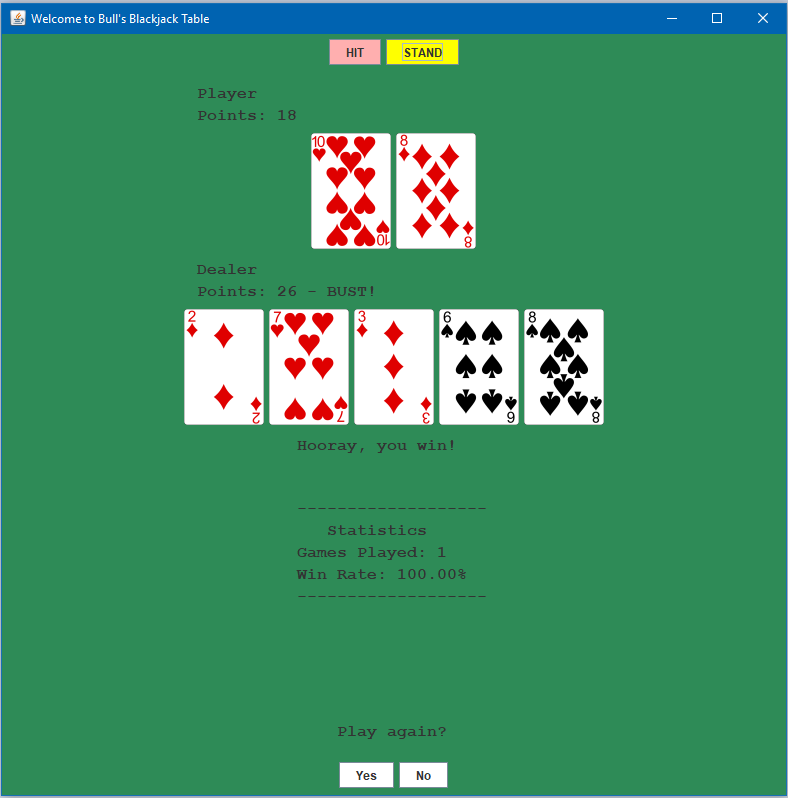

# Blackjack
A basic implementation of Blackjack developed in Java &amp; Swing API

## How to play
Simply run the .jar file. 
Otherwise compile the Blackjack.java file and run it.

## Rules
- Blackjack (Ace and Face Card) beats all hands
- Dealer wins on tie
- If a hand contains an Ace and busts (>21), the Ace value (11) will be counted as 1

## Screenshots

## Possible Improvements
- [ ] Implement proper splitting of an Ace
- [ ] Improve GUI

## Credits
[Byron Knoll](https://byronknoll.blogspot.com/2011/03/vector-playing-cards.html) for the card images
